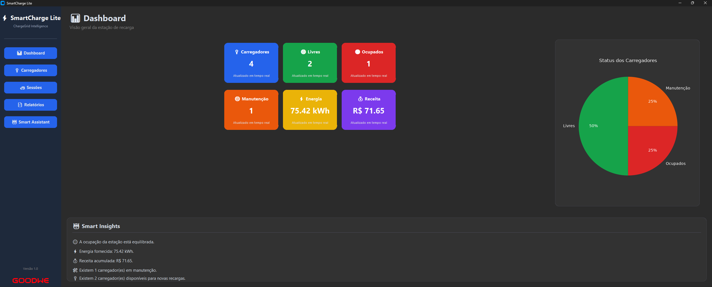
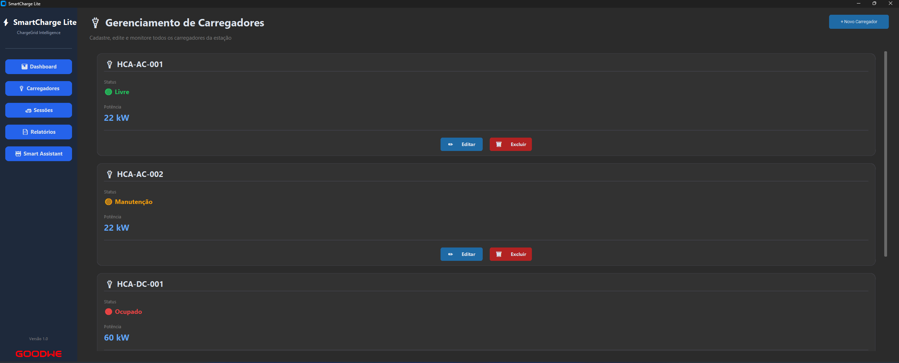
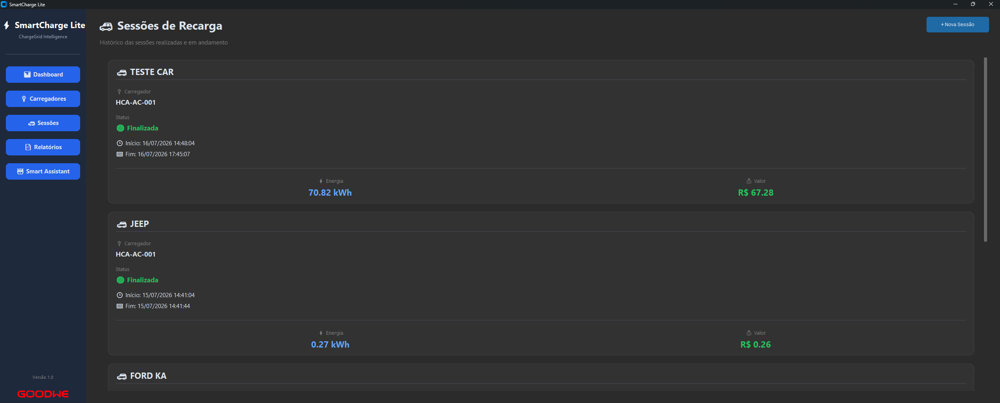
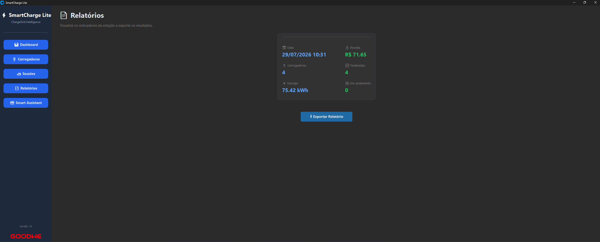
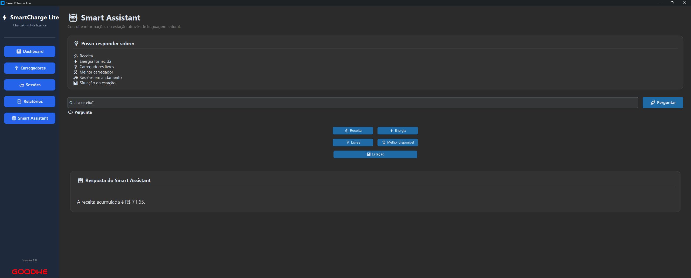

<div align="center">

# ⚡ SmartCharge Lite

### Plataforma inteligente para gerenciamento de estações de recarga GoodWe HCA G2 em ambientes comerciais

[](https://www.python.org/)
[](https://github.com/TomSchimansky/CustomTkinter)
[](https://www.sqlite.org/)
[](#)

[](./docs/INSTALL.md)
[](./docs/USER_GUIDE.md)

<br>

<p align="center">

</p>

</div>

<br>

## 📖 Sobre o Projeto

O **SmartCharge Lite** é uma aplicação desktop desenvolvida em **Python** para o gerenciamento inteligente de estações de recarga **GoodWe HCA G2**. A plataforma oferece monitoramento em tempo real, gerenciamento de carregadores, controle de sessões, geração de relatórios e um assistente inteligente para apoio à tomada de decisões.

<br>

## ✨ Funcionalidades

| | |
|---|---|
| 📊 | **Dashboard em tempo real** |
| 🔌 | **Gerenciamento de carregadores** |
| 🚗 | **Controle de sessões** |
| 📄 | **Relatórios automáticos** |
| 🤖 | **Smart Assistant** |
| 💡 | **Smart Insights** |
| 🗄️ | **Banco de dados SQLite** |
| 📈 | **Indicadores operacionais** |

<br>

## 🖼️ Demonstração

### 📊 Dashboard

<p align="center">

</p>

---

### 🔌 Carregadores

<p align="center">

</p>

---

### 🚗 Sessões

<p align="center">

</p>

---

### 📄 Relatórios

<p align="center">

</p>

---

### 🤖 Smart Assistant

<p align="center">

</p>

</div>

<br>

## 🛠️ Tecnologias

<div align="center">


</div>

- **Python 3** — linguagem principal do sistema
- **CustomTkinter** — interface gráfica moderna
- **SQLite** — persistência de dados local
- **Matplotlib** — geração de gráficos e visualizações
- **Pillow** — manipulação de imagens e ícones

<br>

## 📂 Estrutura do Projeto

```
Challenge-GoodWe-SmartCharge-Lite
│
├── assets/          # Ícones, imagens e recursos visuais
├── database/         # Banco de dados SQLite e scripts
├── interface/         # Telas e componentes da UI (CustomTkinter)
├── modules/          # Lógica de negócio (assistente, relatórios)
├── docs/           # Documentação do projeto
├── main.py          # Ponto de entrada da aplicação
├── .gitignore
└── requirements.txt      # Dependências do projeto
```

<br>

## 🚀 Como Executar

```bash
# Clone o repositório
git clone https://github.com/peperibeirolopes-bot/Challenge-GoodWe-SmartCharge-Lite.git

# Acesse a pasta do projeto
cd Challenge-GoodWe-SmartCharge-Lite

# Instale as dependências
pip install -r requirements.txt

# Execute a aplicação
python main.py
```

📘 Passo a passo completo (ambiente virtual, solução de problemas e geração do executável) em **[`docs/INSTALL.md`](./docs/INSTALL.md)**.

<br>

## 📚 Documentação

| Documento | Descrição |
|---|---|
| ⚙️ [`INSTALL.md`](./docs/INSTALL.md) | Guia de instalação passo a passo |
| 📖 [`USER_GUIDE.md`](./docs/USER_GUIDE.md) | Guia de uso de cada tela do sistema |
| 📄 [`BUSINESS_MODEL`](./docs/BUSINESS_MODEL) | Modelo de negócio e proposta comercial |
| 🔄 [`DATA_FLOW`](./docs/DATA_FLOW) | Fluxo de dados do sistema |
| 🗺️ [`FLUXOGRAMA`](./docs/fluxograma_smartcharge.png) | Fluxograma visual do sistema |

> *Depois adicionamos os outros documentos.*

<br>

## 👥 Equipe

| Integrante | GitHub |
|---|---|
| Nome do integrante 1 | [@usuario](#) |
| Nome do integrante 2 | [@usuario](#) |
| Nome do integrante 3 | [@usuario](#) |

<br>

<div align="center">

**SmartCharge Lite** — Desenvolvido para o desafio **GoodWe ChargeGrid Intelligence 2026** 🔋

</div>
