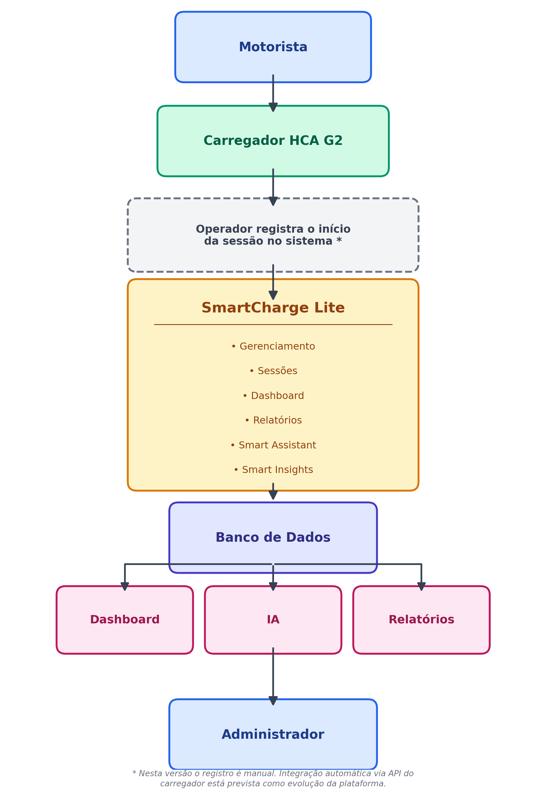

# 🔄 Data Flow

## Visão Geral

O diagrama abaixo representa o fluxo funcional do SmartCharge Lite.

Ele demonstra como as informações percorrem o sistema, desde a utilização do carregador GoodWe HCA G2 pelo motorista até o processamento da aplicação, armazenamento no banco de dados e disponibilização das informações para o administrador através do Dashboard, Relatórios e Smart Assistant.

---

---

## Descrição do Fluxo

1. O motorista conecta o veículo ao carregador GoodWe HCA G2.

2. O operador registra o início da sessão no SmartCharge Lite (nesta versão, esse passo é manual; a integração automática via API do carregador é um próximo passo de evolução da plataforma).

3. O SmartCharge Lite processa as informações da sessão (energia consumida, valor calculado).

4. Os dados são armazenados no banco SQLite.

5. O banco de dados alimenta os módulos:

- Dashboard
- Relatórios
- Smart Assistant
- Smart Insights

6. O administrador acompanha todas as informações em tempo real através da aplicação.
